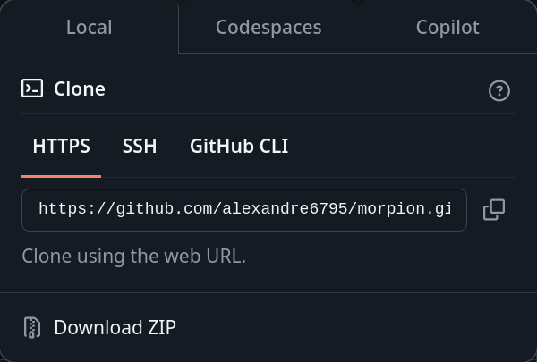
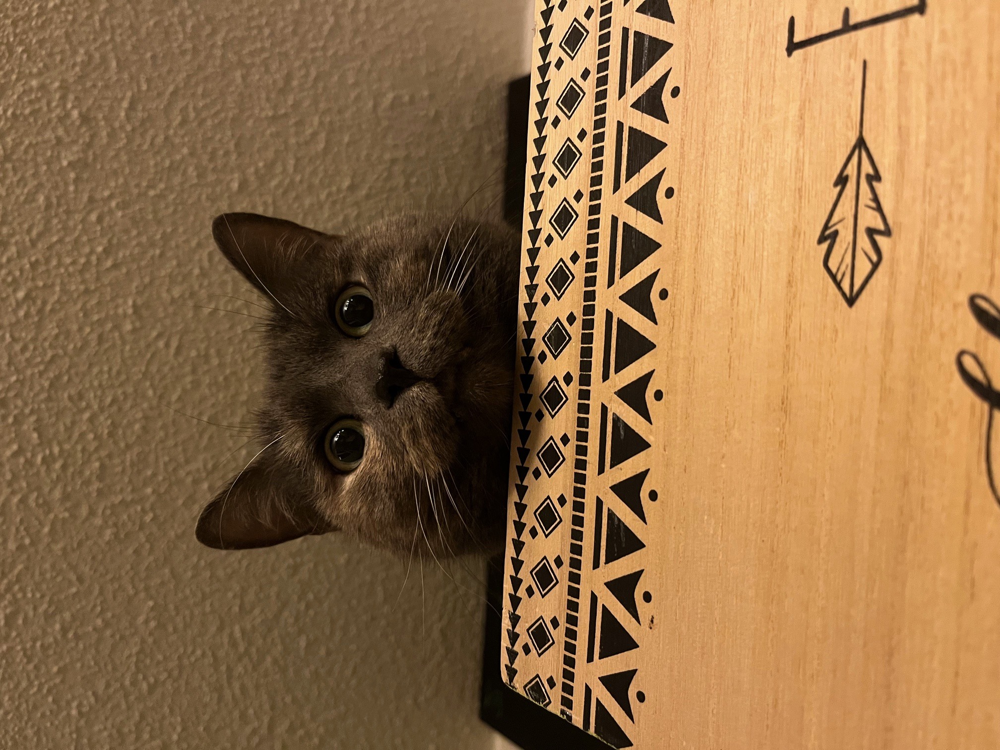
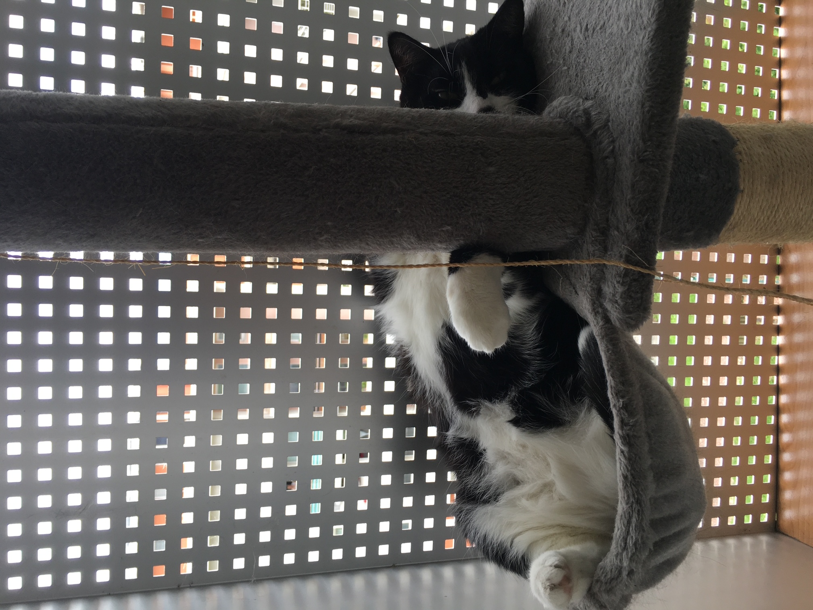

# 🎉 **Bonne Anniv** 🎉

---

**Va sur ton navigateur par défaut puis suis ces étapes :**

---

### 1. **Google Chrome**

1. Ouvre **Google Chrome**.
2. Tape `chrome://settings/content/autoplay` dans la barre d'adresse et appuie sur **Entrée**.
3. Dans le menu qui s'ouvre, vérifie si **Autoplay** est activé. Si ce n'est pas le cas, active-le pour autoriser les vidéos à se lancer automatiquement.

ou

1. Va dans **Paramètres** (les trois points dans le coin supérieur droit > **Paramètres**).
2. Descends et clique sur **Paramètres avancés**.
3. Sous la section **Confidentialité et sécurité**, clique sur **Paramètres de contenu**.
4. Dans la section **Autoplay**, assure-toi que l'option **Autoriser** est activée.

---

### 2. **Mozilla Firefox**

1. Ouvre **Firefox**.
2. Tape `about:config` dans la barre d'adresse et appuie sur **Entrée**.
3. Clique sur le bouton **Accepter le risque et continuer**.
4. Recherche la préférence `media.autoplay.default` :

   - Double-clique dessus et change sa valeur :
     - **0** : Autoriser les vidéos à se lancer automatiquement.
     - **1** : Demander avant de lancer la vidéo.
     - **2** : Bloquer l'autoplay des vidéos.

5. Assure-toi que la valeur est définie sur **0** pour autoriser l'autoplay.


**Pour le reste soit reste sur windaube soit linux**
---

## 🐍 Installation de Python

### 🖥️ Sur Windows

1. Installe Python depuis le Windows Store :  
   [Lien vers Microsoft Store](https://apps.microsoft.com/detail/9ncvdn91xzqp?ocid=webpdpshare)

2. Installe pip :

   le site pour l'installation de pip :  
   [Installer pip sur Windows](https://phoenixnap.com/kb/install-pip-windows)

   Sinon, tu peux aussi utiliser cette commande pour installer pip :

   ```bash
   curl https://bootstrap.pypa.io/get-pip.py -o get-pip.py
   ```

   Après le téléchargement, exécute cette commande pour installer pip :

   ```bash
   python get-pip.py
   ```

## 🐧 Installer linux sur window

1. Installer WSL

   ```bash
   wsl --install
   wsl --update
   ```

   pour verifier apres redemarrage

   ```bash
   wsl --list --verbose
   ```

   Lancer WSL et Installer Python + Pip

2. Ouvrir WSL

   Ouvre PowerShell et tape cette commande pour lancer WSL :

   ```bash
   wsl
   ```

3. Mettre à Jour le Système
   ```bash
   sudo apt update && sudo apt upgrade -y
   ```

4. 🐍Installer Python

   ```bash
   python3 --version
   ```

   Si Python n'est pas installé

   ```bash
   sudo apt install python3 -y
   ```

5. 📦Installer Pip (Gestionnaire de Paquets Python)

   ```bash
   sudo apt install python3-pip -y
   ```
   Vérifie l’installation avec :
   ```bash
   pip3 --version
   ```


# 🎮 Morpion Game

### Étape 1 : Télécharger le code

1. :  
   

2. :  
   

3. :  
   

### Étape 2 : Cloner le dépôt

4. Ouvre une console Windows (invite de commandes ou PowerShell). Tu peux faire ça en cherchant "cmd" ou "PowerShell" dans le menu Démarrer de Windows.

5. Une fois ta console ouverte, tape cette commande pour cloner le dépôt Git dans ton dossier **Documents**. Assure-toi de remplacer le lien par celui que tu viens de copier à l'étape précédente.

   ```bash
   git clone le_lien_que_tu_as_copier
   ```

---

### Étape 3 : COURAGE

un peu de mignonnerie pour t'encourager🐾🐈🐾🐈

NE CLIC PAS SUR LES CHATS🐈❌⚠️❌⚠️❌⚠️❌⚠️❌⚠️❌⚠️❌⚠️

[](https://www.youtube.com/watch?v=l04BpnlteSY&autoplay=1)

Ok, tu as cliqué sur le 1er mais pas le second, stp.

[](https://www.youtube.com/watch?v=OF8YS7DUYe8&autoplay=1)

### Étape 4 : Mode Easy

tu peux directement copier la commande ci-dessous :

```bash
git clone https://github.com/alexandre6795/morpion-game.git
```

## 🚀 Exécution de l'Exécutable via la Ligne de Commande

### 🖥️ Sur Windows

**Exécution via Commande** :

1. Ouvre l'Invite de Commande (CMD).
2. Va dans le répertoire où l'exécutable est situé.
3. Exécute l'exécutable en tapant :

   ```bash
   launch_morpion.bat
   ```

### ⚠️ Problème de Droits d'Exécution sur Windows

En général, il n'y a pas de problème de droits d'exécution sur Windows.

Si tu rencontres ce genre de problème, voici comment faire :

Clique droit sur le fichier launch.morpion.bat, puis choisis "Exécuter en tant qu'administrateur" pour contourner les restrictions de sécurité.

Si ça ne marche pas, exécute la commande suivante dans PowerShell :

Powershell -ExecutionPolicy UnRestricted -command "C:\chemin\vers\MonScriptPowerShell.ps1"

Une fois terminé, remets la politique d'exécution par défaut avec cette commande :

Set-ExecutionPolicy Restricted

Et vérifie si la politique d'exécution a bien été modifiée avec :

Get-ExecutionPolicy

📌 Voici un article utile à lire si tu rencontres encore des problèmes (non, tu n'as rien d'autre à faire le jour de ton anniversaire 😆) :Autoriser l'exécution de scripts PowerShell désactivée

---

### 🐧 Sur Linux

**Exécution via Commande** :

1. Ouvre le terminal.
2. Va dans le répertoire où l'exécutable est situé.
3. Exécute l'exécutable en tapant :

   ```bash
   ./launch_morpion.sh
   ```

#### ⚠️ Problème de Droits d'Exécution sur Linux

Si tu obtiens une erreur **"Permission Denied"** ou si le script `.sh` ne s'exécute pas, cela signifie probablement que le fichier `launch.morpion.sh` n'a pas les permissions d'exécution nécessaires. Voici comment résoudre ça :

1. **Ouvre un terminal.**
2. **Va dans le répertoire du projet où se trouve `launch.morpion.sh`.**
3. **Exécute cette commande pour ajouter les permissions d'exécution** :

   ```bash
   chmod +x launch.morpion.sh
   ```

---